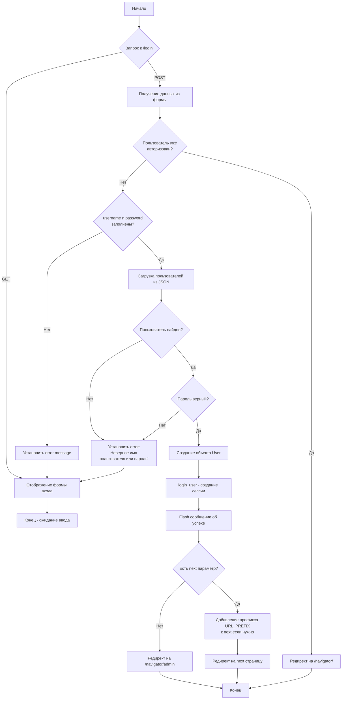
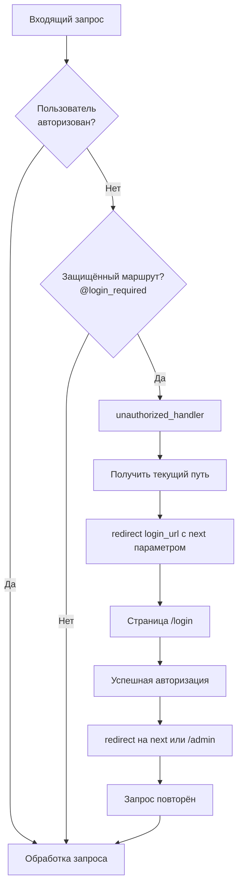
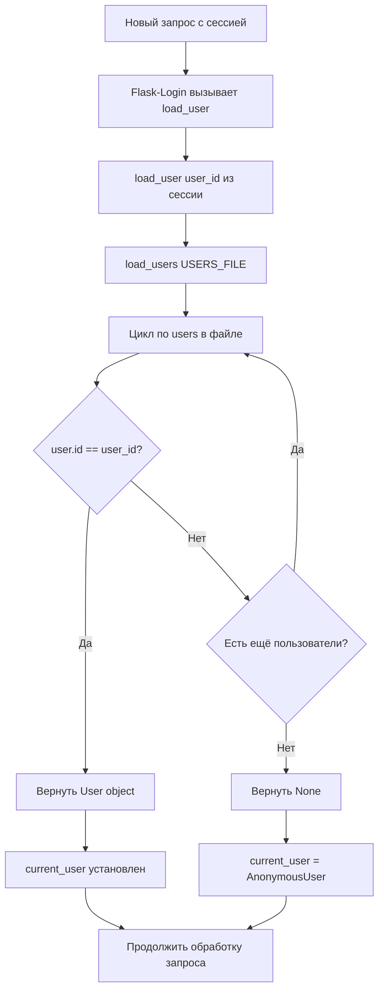
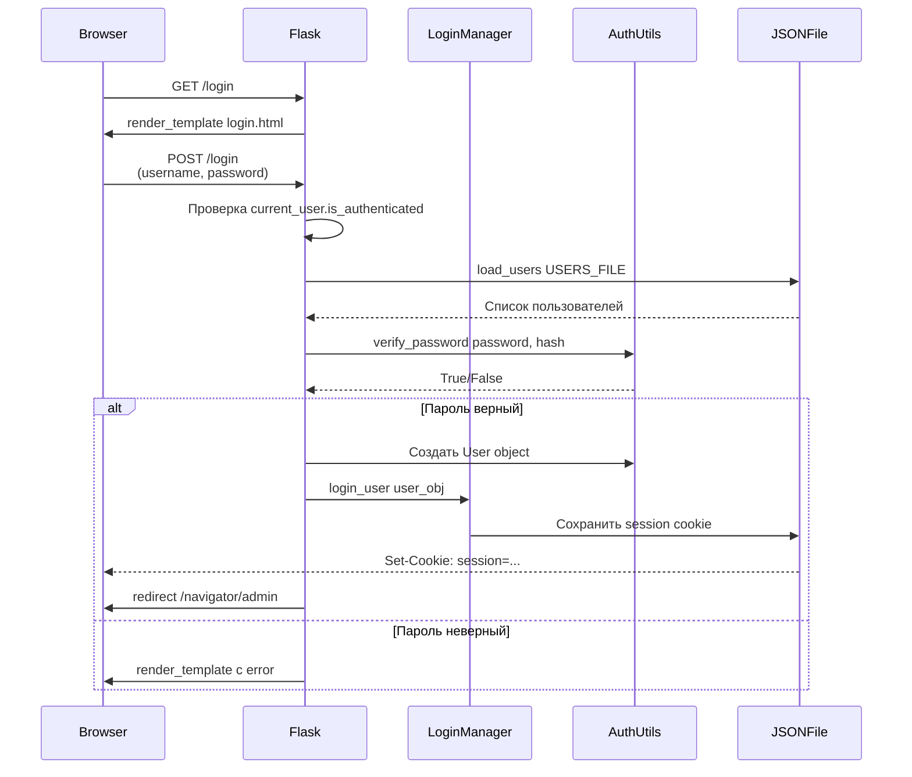

# Блок-схема авторизации в app.py

## Общая схема процесса авторизации



## Детальная схема проверки учётных данных

```mermaid
flowchart TD
    A[POST /login] --> B[username = request.form.get('username')]
    B --> C[password = request.form.get('password')]
    C --> D[remember = request.form.get('remember')]
    
    D --> E{Поля заполнены?}
    E -->|Нет| F[error = 'Введите имя пользователя и пароль']
    E -->|Да| G[users_data = load_users USERS_FILE]
    
    F --> H[Рендер login.html с error]
    G --> I[Цикл по всем пользователям]
    
    I --> J{username совпадает?}
    J -->|Нет| K{Есть ещё пользователи?}
    J -->|Да| L[user_found = текущий пользователь]
    
    K -->|Да| I
    K -->|Нет| M[error = 'Неверное имя пользователя или пароль']
    M --> H
    
    L --> N[verify_password password, user_found.password_hash]
    N --> O{Пароль верный?}
    O -->|Нет| M
    O -->|Да| P[User object = User id, username, is_admin]
    
    P --> Q[login_user user_obj, remember=remember]
    Q --> R[flash 'Вы успешно вошли в систему']
    
    R --> S{next параметр существует?}
    S -->|Нет| T[redirect URL_PREFIX + '/admin']
    S -->|Да| U{URL_PREFIX в next?}
    
    U -->|Нет| V[Добавить URL_PREFIX к next]
    U -->|Да| W[Использовать next как есть]
    
    V --> X[redirect next_page]
    W --> X
    T --> Y[Конец]
    X --> Y
```

## Схема работы Flask-Login middleware



## Схема загрузки пользователя из сессии



## Схема выхода из системы (logout)

```mermaid
flowchart TD
    A[GET /logout] --> B{@login_required проверка}
    B --> C{Пользователь<br/>авторизован?}
    
    C -->|Нет| D[redirect на login]
    C -->|Да| E[logout_user]
    
    E --> F[Удаление сессии пользователя]
    F --> G[flash 'Вы вышли из системы']
    
    G --> H[redirect URL_PREFIX + '/']
    H --> I[Конец - главная страница]
    
    D --> I
```

## Последовательность событий при авторизации



## Ключевые компоненты системы авторизации

### 1. Инициализация (в начале app.py)
```python
login_manager = LoginManager()
login_manager.init_app(app)
login_manager.login_view = 'login'
login_manager.login_message = LOGIN_MESSAGE
login_manager.session_protection = SESSION_PROTECTION
```

### 2. Callback функция load_user
```python
@login_manager.user_loader
def load_user(user_id):
    users_data = load_users(USERS_FILE, hash_password)
    for user in users_data.get('users', []):
        if str(user['id']) == str(user_id):
            return User(user['id'], user['username'], user.get('is_admin', False))
    return None
```

### 3. Декораторы защиты маршрутов
```python
@app.route('/logout')
@login_required  # Требует авторизации
def logout():
    ...

@app.route('/admin')
@admin_required  # Требует прав администратора
def admin_panel():
    ...
```

### 4. Обработчик неавторизованного доступа
```python
@login_manager.unauthorized_handler
def unauthorized():
    current_path = urlparse(request.url).path
    return redirect(login_manager.login_url(current_path))
```

## Точки расширения безопасности

1. **Rate Limiting**: `@limiter.limit(RATELIMIT_LOGIN)` - защита от брутфорса
2. **CSRF Protection**: `csrf_token()` в форме - защита от CSRF атак
3. **Password Hashing**: `hash_password()` / `verify_password()` - хеширование паролей
4. **Session Protection**: `login_manager.session_protection` - защита сессии
5. **Remember Me**: Опция запоминания пользователя через cookie
