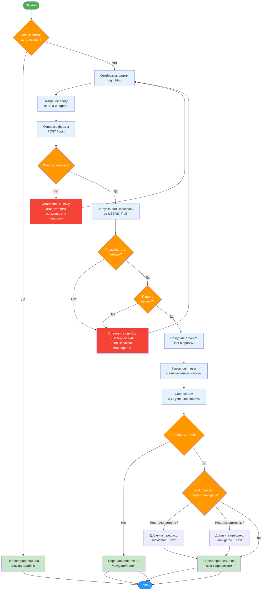

```mermaid
flowchart TD
    Start([Начало]) --> CheckAuth{Пользователь<br/>авторизован?}
    
    CheckAuth -->|Да | RedirectMain[Перенаправление на<br/>/navigator/admin]
    RedirectMain --> End([Конец])
    
    CheckAuth -->|Нет | ShowLogin[Отобразить форму<br/>login.html]
    ShowLogin --> WaitForInput[Ожидание ввода<br/>логина и пароля]
    WaitForInput --> SubmitForm[Отправка формы<br/>POST /login]
    
    SubmitForm --> ValidateInput{Поля заполнены?}
    ValidateInput -->|Нет | SetError[Установить ошибку:<br/>«Введите имя пользователя<br/>и пароль»]
    SetError --> ShowLogin
    
    ValidateInput -->|Да | LoadUsers[Загрузка пользователей<br/>из USERS_FILE]
    LoadUsers --> FindUser{Пользователь<br/>найден?}
    
    FindUser -->|Нет | SetErrorCreds[Установить ошибку:<br/>«Неверное имя пользователя<br/>или пароль»]
    SetErrorCreds --> ShowLogin
    
    FindUser -->|Да | VerifyPass{Пароль<br/>верный?}
    VerifyPass -->|Нет | SetErrorCreds
    
    VerifyPass -->|Да | CreateUserObj[Создание объекта<br/>User с правами]
    CreateUserObj --> LoginUser[Вызов login_user<br/>с запоминанием сессии]
    LoginUser --> FlashMsg[Сообщение:<br/>«Вы успешно вошли»]
    FlashMsg --> CheckNext{Есть параметр next?}
    
    CheckNext -->|Нет | RedirectAdmin[Перенаправление на<br/>/navigator/admin]
    RedirectAdmin --> End
    
    CheckNext -->|Да | ProcessNext{next содержит<br/>префикс /navigator?}
    ProcessNext -->|Нет, начинается с / | AddPrefix[Добавить префикс:<br/>/navigator + next]
    AddPrefix --> RedirectNext[Перенаправление на<br/>next с префиксом]
    RedirectNext --> End
    
    ProcessNext -->|Нет, относительный | AddPrefixRel[Добавить префикс:<br/>/navigator/ + next]
    AddPrefixRel --> RedirectNext
    
    ProcessNext -->|Да | RedirectNext
    
    RedirectAdmin --> End
    RedirectNext --> End
    
    style Start fill:#4CAF50,color:#fff
    style End fill:#2196F3,color:#fff
    style CheckAuth fill:#FF9800,color:#fff
    style ValidateInput fill:#FF9800,color:#fff
    style FindUser fill:#FF9800,color:#fff
    style VerifyPass fill:#FF9800,color:#fff
    style CheckNext fill:#FF9800,color:#fff
    style ProcessNext fill:#FF9800,color:#fff
    style SetError fill:#f44336,color:#fff
    style SetErrorCreds fill:#f44336,color:#fff
    style ShowLogin fill:#E3F2FD
    style WaitForInput fill:#E3F2FD
    style SubmitForm fill:#E3F2FD
    style LoadUsers fill:#E3F2FD
    style CreateUserObj fill:#E3F2FD
    style LoginUser fill:#E3F2FD
    style FlashMsg fill:#E3F2FD
    style RedirectMain fill:#C8E6C9
    style RedirectAdmin fill:#C8E6C9
    style RedirectNext fill:#C8E6C9
```
