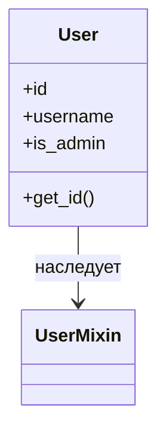
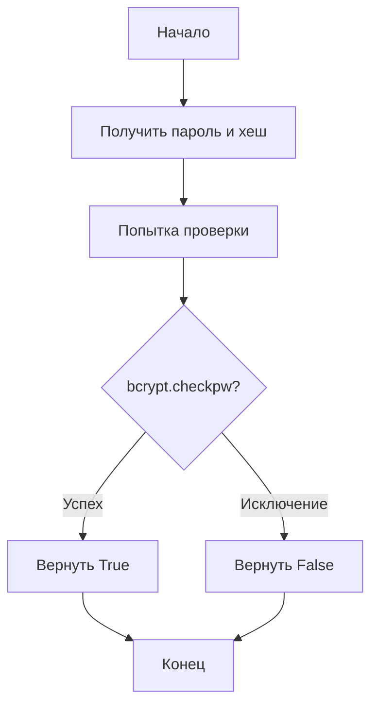

# Блок-схема: utils/auth_utils.py

## Обзор модуля
Модуль содержит утилиты для аутентификации и управления пользователями в Flask-приложении.

---

## 1. Класс User



**Логика инициализации:**
```
┌─────────────────┐
│   __init__()    │
│  (id, username, │
│   is_admin)     │
└────────┬────────┘
         │
         ▼
┌─────────────────┐
│  self.id = id   │
└────────┬────────┘
         │
         ▼
┌─────────────────────┐
│ self.username =     │
│     username        │
└────────┬────────────┘
         │
         ▼
┌─────────────────────┐
│ self.is_admin =     │
│     is_admin        │
└────────┬────────────┘
         │
         ▼
┌─────────────────┐
│  get_id() →     │
│  str(self.id)   │
└─────────────────┘
```

---

## 2. Функция hash_password(password)

```mermaid
flowchart TD
    A[Начало] --> B[Получить пароль]
    B --> C[Кодировать в bytes]
    C --> D[Сгенерировать соль через bcrypt.gensalt()]
    D --> E[Хешировать bcrypt.hashpw()]
    E --> F[Декодировать в строку]
    F --> G[Вернуть хеш]
    G --> H[Конец]
```

---

## 3. Функция verify_password(password, password_hash)



**Детальная логика:**
```
┌──────────────────┐
│      Начало      │
└────────┬─────────┘
         │
         ▼
┌──────────────────┐
│ try:             │
│  checkpw(password│
│   .encode(),     │
│   hash.encode()) │
└────────┬─────────┘
         │
         ▼
    ┌────┴────┐
    │ Успех?  │
    └────┬────┘
         │
    ┌────┴────┐
    │         │
   Да        Нет (Exception)
    │         │
    ▼         ▼
┌───────┐  ┌──────────┐
│True   │  │ False    │
└───┬───┘  └────┬─────┘
    │           │
    └─────┬─────┘
          │
          ▼
     ┌────────┐
     │ Конец  │
     └────────┘
```

---

## 4. Функция create_user(username, password, is_admin=False)

```mermaid
flowchart TD
    A[Начало] --> B[Получить username, password, is_admin]
    B --> C[Вызвать hash_password(password)]
    C --> D[Получить текущее время datetime.now()]
    D --> E[Преобразовать в ISO формат]
    E --> F[Создать словарь пользователя]
    F --> G[Вернуть словарь]
    G --> H[Конец]
```

**Структура возвращаемого словаря:**
```python
{
    "id": None,
    "username": username,
    "password_hash": <hashed_password>,
    "is_admin": is_admin,
    "created_at": <iso_timestamp>
}
```

---

## 5. Декоратор admin_required_decorator(f)

```mermaid
flowchart TD
    A[Запрос к защищённой функции] --> B{current_user.is_authenticated?}
    B -->|Нет| C{API запрос? /api/*}
    B -->|Да| D{current_user.is_admin?}
    D -->|Да| E[Вызвать оригинальную функцию f()]
    D -->|Нет| C
    C -->|Да| F[Вернуть JSON 401 Unauthorized]
    C -->|Нет| G[Flash сообщение об ошибке]
    G --> H[Получить SCRIPT_NAME префикс]
    H --> I{SCRIPT_NAME пустой?}
    I -->|Да| J[Использовать '/navigator']
    I -->|Нет| K[Использовать SCRIPT_NAME]
    J --> L[Построить login_url]
    K --> L
    L --> M[Добавить параметр next с полным путём]
    M --> N[Редирект на страницу входа]
    E --> O[Конец]
    F --> O
    N --> O
```

**Детальная последовательность:**
```
┌────────────────────────┐
│  Запрос к функции      │
└───────────┬────────────┘
            │
            ▼
    ┌───────────────────┐
    │ Проверка:         │
    │ is_authenticated? │
    └─────────┬─────────┘
              │
     ┌────────┴────────┐
     │                 │
    Нет               Да
     │                 │
     │                 ▼
     │         ┌───────────────────┐
     │         │ Проверка:         │
     │         │ is_admin?         │
     │         └─────────┬─────────┘
     │                   │
     │            ┌──────┴──────┐
     │            │             │
     │           Нет            Да
     │            │             │
     │            │             ▼
     │            │    ┌─────────────────┐
     │            │    │ Вызов f(*args)  │
     │            │    └────────┬────────┘
     │            │             │
     │            │             ▼
     │            │    ┌─────────────────┐
     │            │    │   Вернуть       │
     │            │    │   результат f   │
     │            │    └─────────────────┘
     │            │
     ▼            ▼
┌──────────────────────────┐
│ Проверка: API запрос?    │
│ (path.startswith('/api'))│
└───────────┬──────────────┘
            │
     ┌──────┴──────┐
     │             │
    Да            Нет
     │             │
     ▼             ▼
┌─────────────┐ ┌────────────────────┐
│JSON 401     │ │ Flash сообщение    │
│Unauthorized │ │ 'Требуется права   │
└─────────────┘ │  администратора'   │
                └─────────┬──────────┘
                          │
                          ▼
                ┌────────────────────┐
                │ Получить SCRIPT_NAME│
                │ из environ         │
                └─────────┬──────────┘
                          │
                          ▼
                  ┌───────────────┐
                  │ Пустой?       │
                  └───────┬───────┘
                          │
                   ┌──────┴──────┐
                   │             │
                  Да            Нет
                   │             │
                   ▼             ▼
           ┌───────────┐  ┌──────────────┐
           │'/navigator│  │SCRIPT_NAME   │
           └─────┬─────┘  └──────┬───────┘
                 │               │
                 └───────┬───────┘
                         │
                         ▼
               ┌─────────────────────┐
               │ Построить URL:      │
               │ login_url = prefix  │
               │ + '/login'          │
               └─────────┬───────────┘
                         │
                         ▼
               ┌─────────────────────┐
               │ full_next = prefix  │
               │ + request.path      │
               └─────────┬───────────┘
                         │
                         ▼
               ┌─────────────────────┐
               │ redirect(login_url  │
               │ + '?next=' + next)  │
               └─────────────────────┘
```

---

## Общая архитектура модуля

```
┌─────────────────────────────────────────────────────────────┐
│                    auth_utils.py                            │
├─────────────────────────────────────────────────────────────┤
│                                                             │
│  ┌─────────────┐   ┌──────────────┐   ┌─────────────────┐  │
│  │    User     │   │  hash_       │   │  verify_        │  │
│  │   Class     │   │  password()  │   │  password()     │  │
│  └─────────────┘   └──────────────┘   └─────────────────┘  │
│                                                             │
│  ┌─────────────┐   ┌──────────────────────────────────┐    │
│  │  create_    │   │  admin_required_decorator()      │    │
│  │  user()     │   │                                  │    │
│  └─────────────┘   │  • Проверка аутентификации       │    │
│                    │  • Проверка прав администратора   │    │
│                    │  • Обработка API запросов (401)  │    │
│                    │  • Редирект на login с next      │    │
│                    └──────────────────────────────────┘    │
│                                                             │
└─────────────────────────────────────────────────────────────┘
                         │
         ┌───────────────┼───────────────┐
         │               │               │
         ▼               ▼               ▼
   ┌──────────┐   ┌────────────┐  ┌─────────────┐
   │ bcrypt   │   │ Flask-     │  │ Flask       │
   │ library  │   │ Login      │  │ (request,   │
   │          │   │ (UserMixin,│  │  flash,     │
   │          │   │  current_  │  │  redirect)  │
   │          │   │  user)     │  │             │
   └──────────┘   └────────────┘  └─────────────┘
```

---

## Поток данных при аутентификации

```
1. Регистрация пользователя:
   ┌──────────┐    ┌──────────────┐    ┌─────────────┐
   │ Ввод     │───▶│ create_user()│───▶│ Сохранение  │
   │ данных   │    │ + hash_      │    │ в users.json│
   │          │    │ password()   │    │             │
   └──────────┘    └──────────────┘    └─────────────┘

2. Вход пользователя:
   ┌──────────┐    ┌──────────────┐    ┌─────────────┐
   │ Логин/   │───▶│ verify_      │───▶│ Создание   │
   │ Пароль   │    │ password()   │    │ объекта User│
   └──────────┘    └──────────────┘    └─────────────┘

3. Доступ к защищённой странице:
   ┌──────────┐    ┌──────────────────┐    ┌──────────┐
   │ Запрос   │───▶│ admin_required_  │───▶│ Доступ   │
   │ ресурса  │    │ decorator()      │    │ разрешён │
   └──────────┘    └──────────────────┘    └──────────┘
                           │
                    ┌──────┴──────┐
                    │             │
              Отказано      Редирект на
              (401 JSON)     /login
```
