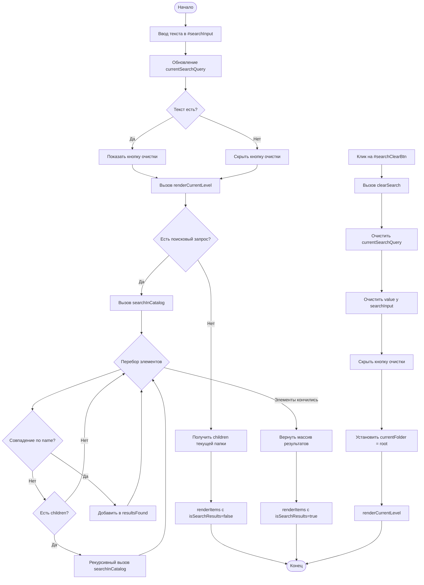

# Блок-схема поиска элементов

## Описание блоков:

1. **Ввод данных**: Пользователь вводит текст в поле `#searchInput`
2. **Обработка ввода**: 
   - Обновляется переменная `currentSearchQuery`
   - Показывается/скрывается кнопка очистки в зависимости от наличия текста
3. **Рендеринг**: Вызывается `renderCurrentLevel()`
4. **Логика поиска**:
   - Если запрос пустой → отображаются дети текущей папки
   - Если запрос есть → запускается рекурсивный поиск `searchInCatalog()`
5. **Рекурсивный поиск**:
   - Проходит по всем элементам каталога
   - Сравнивает `name` элемента с запросом (case-insensitive)
   - При совпадении добавляет в результат
   - Если у элемента есть `children`, рекурсивно ищет внутри них
6. **Отображение результатов**: Результаты передаются в `renderItems()` с флагом `isSearchResults=true`
7. **Очистка**: Клик на кнопку очистки сбрасывает всё и возвращает к корневой папке
